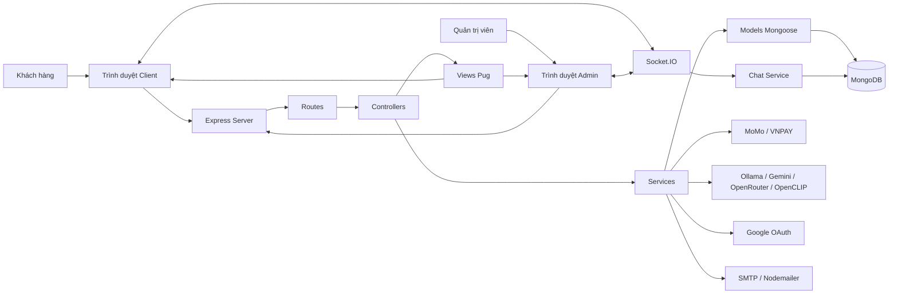
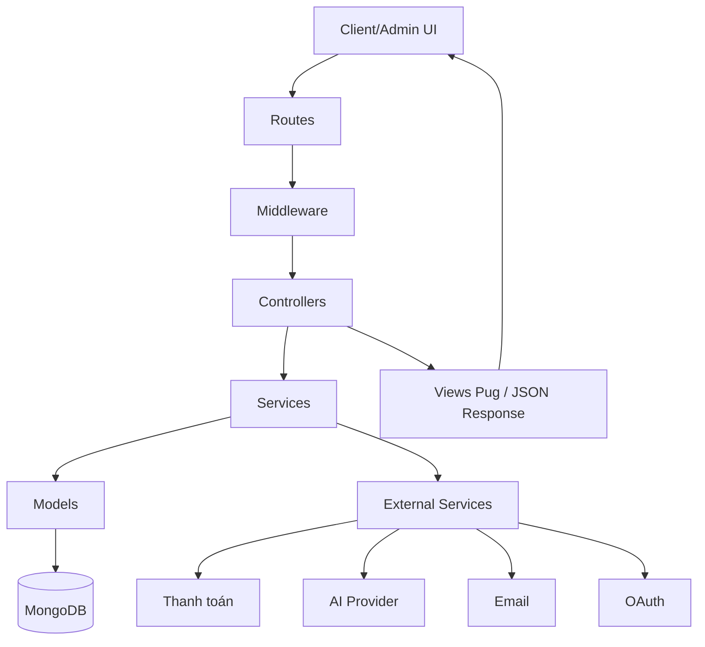
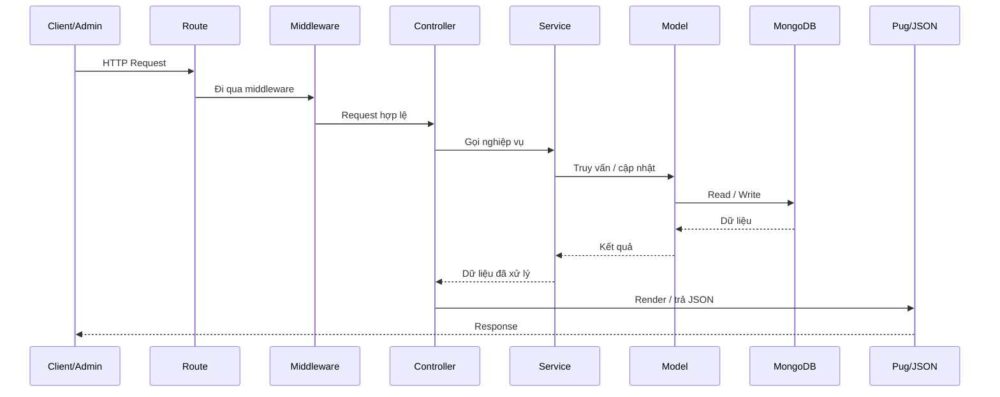

# Tổng Quan Công Nghệ Và Mô Hình Hệ Thống

## 1. Giới thiệu ngắn

`TMDT_ThoiTrang` là một hệ thống thương mại điện tử thời trang xây dựng theo mô hình web application full-stack dùng `Node.js + Express + MongoDB + Pug`.

Hệ thống phục vụ 2 nhóm người dùng chính:

- `Client`: khách hàng mua sắm, quản lý tài khoản, giỏ hàng, đơn hàng, đánh giá, chat và AI assistant.
- `Admin`: quản trị sản phẩm, danh mục, thương hiệu, banner, flash sale, lookbook, đơn hàng, nhập xuất kho, báo cáo, voucher và chat hỗ trợ.

Ngoài các chức năng TMĐT cơ bản, dự án còn tích hợp:

- thanh toán online `VNPAY`, `MoMo`
- chat realtime bằng `Socket.IO`
- AI chat assistant với `Ollama`, `Gemini`, `OpenRouter`
- semantic search sản phẩm bằng `OpenCLIP`

## 2. Công nghệ sử dụng

### 2.1. Backend

- `Node.js`
- `Express 5`
- `CommonJS`
- `http` native server để bọc Express và gắn `Socket.IO`
- `Mongoose` để làm việc với MongoDB
- `Socket.IO` cho chat realtime
- `Passport` + `passport-google-oauth20` cho xác thực Google
- `express-session` + `connect-mongo` để lưu session trong MongoDB
- `cookie-parser` để đọc cookie
- `express-flash` để hiển thị flash message theo session
- `csurf` để chống CSRF
- `helmet` để tăng cường HTTP security headers
- `cors` để kiểm soát truy cập cross-origin
- `express-rate-limit` để giới hạn request
- `express-mongo-sanitize` để chống NoSQL injection
- middleware tự viết `xssSanitize` để làm sạch input
- `nodemailer` để gửi email
- `multer` để upload file
- `exceljs` để xuất Excel
- `bcryptjs` để băm mật khẩu
- `express-validator`, `validator` để validate dữ liệu
- `qs` để build/serialize query string ở một số luồng thanh toán như `VNPAY`
- `fetch` native của Node.js để gọi HTTP API ra ngoài, chủ yếu cho AI providers (`Ollama`, `Gemini`, `OpenRouter`)

### 2.2. Frontend

- `Pug` làm view engine phía server
- `Bootstrap 5`
- `Bootstrap Icons`
- `Font Awesome 6.5.1` tải qua CDN ở client layout
- `JavaScript` thuần phía client
- `jQuery 3.7.1` chỉ dùng cục bộ ở một số màn admin, hiện thấy rõ ở form `lookbook` và `flash sales`
- `Select2` dùng trên các màn admin cần chọn nhiều/tra cứu sản phẩm
- `Socket.IO client` được nạp ở layout client/admin cho chat realtime
- `AJAX` chủ yếu qua `Fetch API`
- có wrapper `window.App.apiFetch` trong `public/js/shared/utils.js`
- có patch global trong `public/js/shared/csrf.js` để tự gắn `X-CSRF-Token` vào `fetch` cùng origin
- có dùng header `X-Requested-With: XMLHttpRequest` ở một số luồng để phân biệt request async
- hiện không thấy sử dụng `axios` hoặc `$.ajax` trong codebase
- CSS tĩnh trong thư mục `public/`
- vendor assets nội bộ hiện có `Bootstrap` và `Bootstrap Icons` trong `public/vendor/`

### 2.3. Database

- `MongoDB`
- `Mongoose Schema` để định nghĩa collection
- mô hình dữ liệu document-oriented
- có sử dụng:
  - `embedded document`
  - `ObjectId ref`
  - `index`
  - `unique index`
  - `sparse index`
  - `virtual field`

### 2.4. AI và tìm kiếm thông minh

- `Ollama` cho mô hình local
- `Gemini API`
- `OpenRouter`
- `OpenCLIP` cho text-to-image retrieval / semantic product search
- Python script hỗ trợ ranking ảnh trong thư mục `scripts/`

### 2.5. Thanh toán và dịch vụ ngoài

- `VNPAY`
- `MoMo`
- `Google OAuth`
- `SMTP` qua `nodemailer`

### 2.6. Bảng các phần mềm/công cụ sử dụng

| STT | Phần mềm / công cụ | Chức năng | Giai đoạn sử dụng |
| --- | --- | --- | --- |
| 1 | `Visual Studio Code` | Soạn thảo mã nguồn, quản lý dự án và chỉnh sửa tài liệu | Phân tích, thiết kế, lập trình |
| 2 | `Node.js` | Môi trường chạy ứng dụng backend và các script của dự án | Lập trình, chạy ứng dụng |
| 3 | `MongoDB Server` | Hệ quản trị cơ sở dữ liệu dùng để lưu trữ dữ liệu hệ thống | Thiết kế CSDL, chạy ứng dụng |
| 4 | `MongoDB Compass` | Công cụ trực quan để xem, kiểm tra và thao tác dữ liệu MongoDB | Thiết kế CSDL, kiểm thử dữ liệu |
| 5 | `Google Chrome` | Truy cập, kiểm thử giao diện client/admin và các chức năng web | Kiểm thử, chạy ứng dụng |
| 6 | `Postman` | Kiểm thử API, gửi request và kiểm tra response | Kiểm thử chức năng |
| 7 | `Mermaid Live Editor` | Vẽ sơ đồ kiến trúc hệ thống, sơ đồ xử lý và mô hình dữ liệu | Phân tích hệ thống, thiết kế |
| 8 | `PlantUML` | Vẽ sơ đồ use case và một số sơ đồ phục vụ tài liệu phân tích thiết kế | Phân tích hệ thống, thiết kế |
| 9 | `Python` | Chạy các script hỗ trợ `OpenCLIP` trong chức năng tìm kiếm thông minh | Tích hợp AI, chạy ứng dụng |
| 10 | `Ollama` | Chạy mô hình AI local phục vụ chatbot khi bật cấu hình AI cục bộ | Tích hợp AI, chạy ứng dụng |

Gợi ý trình bày trong báo cáo:

- Nếu giảng viên hỏi theo hướng “phần mềm cài trên máy”, bảng này là cách trình bày phù hợp hơn so với liệt kê thư viện như `Express`, `Bootstrap`, `Mongoose`.
- Dự án này dùng `Node.js + MongoDB`, vì vậy thông thường sẽ dùng `MongoDB Compass` để quản lý dữ liệu, không dùng `XAMPP` như các dự án `PHP + MySQL`.

## 3. Mô hình kiến trúc hệ thống

## 3.1. Kiểu kiến trúc

Hệ thống hiện tại đi theo hướng:

- `Monolithic Web Application`
- tách lớp theo kiểu `MVC + Service Layer`
- render view phía server bằng `Pug`
- bổ sung `Socket Layer` cho chat realtime

Có thể mô tả ngắn gọn là:

`Client/Admin Browser -> Routes -> Controllers -> Services -> Models(Mongoose) -> MongoDB`

Riêng chat realtime:

`Client/Admin Browser -> Socket.IO -> chat.socket.js -> communication services -> MongoDB`

## 3.1.1. Sơ đồ kiến trúc tổng thể



## 3.1.2. Sơ đồ MVC + Service Layer



## 3.2. Các lớp chính

### `routes/`

Chịu trách nhiệm khai báo endpoint cho:

- client
- admin
- admin api
- client api

### `controllers/`

Nhận request từ route, điều phối dữ liệu đầu vào/đầu ra và gọi service tương ứng.

### `services/`

Đây là lớp xử lý nghiệp vụ chính của dự án. Repo đang chia service theo domain:

- `account`
- `auth`
- `cart`
- `catalog`
- `communication`
- `content`
- `inventory`
- `order`
- `payment`
- `review`

### `models/`

Định nghĩa schema MongoDB bằng `Mongoose`.

### `views/`

Giao diện `Pug` tách riêng cho:

- `views/client`
- `views/admin`

### `public/`

Chứa tài nguyên tĩnh:

- JS
- CSS
- ảnh
- uploads
- vendor assets

Ghi chú frontend runtime:

- Script client/admin chủ yếu đặt trong `public/js` và `public/admin/js`
- Có tải thư viện ngoài qua CDN ở một số view admin (ví dụ `jQuery`, `Select2`)
- Client layout cũng tải `Font Awesome` qua CDN
- Form POST truyền thống dùng hidden `_csrf`, còn các request async chủ yếu đi qua `fetch`

### `socketio/`

Quản lý kết nối realtime, hiện chủ yếu phục vụ chat giữa admin và khách hàng.

## 4. Cấu trúc thư mục thực tế

```text
.
├─ index.js
├─ config/
├─ controllers/
│  ├─ admin/
│  └─ client/
├─ helpers/
├─ middlewares/
├─ models/
├─ public/
│  ├─ admin/
│  ├─ css/
│  ├─ images/
│  ├─ js/
│  ├─ uploads/
│  └─ vendor/
├─ routes/
│  ├─ admin/
│  └─ client/
├─ scripts/
├─ services/
│  ├─ account/
│  ├─ auth/
│  ├─ cart/
│  ├─ catalog/
│  ├─ communication/
│  ├─ content/
│  ├─ inventory/
│  ├─ order/
│  ├─ payment/
│  └─ review/
├─ socketio/
├─ views/
│  ├─ admin/
│  ├─ client/
│  └─ partials/
├─ README.md
└─ model.md
```

Lưu ý: kiến trúc thực tế hiện đang bootstrap trực tiếp trong `index.js`, chưa tách thành thư mục `app/` như một số mô tả cũ trong `README.md`.

## 5. Mô hình xử lý request

Một request thông thường đi qua các bước:

1. `Express route` nhận request
2. chạy middleware bảo mật, auth, sanitize, session
3. `Controller` nhận request
4. `Service` xử lý nghiệp vụ
5. `Model` đọc/ghi MongoDB
6. trả về:
   - HTML qua `Pug`
   - JSON qua API
   - hoặc emit event qua `Socket.IO`

## 5.1. Sơ đồ luồng xử lý request



## 6. Các module nghiệp vụ chính

### 6.1. Người dùng và xác thực

- đăng ký / đăng nhập
- đăng nhập Google
- phân quyền `admin` / `user`
- quản lý session riêng cho client và admin
- quên mật khẩu / reset mật khẩu
- log đăng nhập

### 6.2. Danh mục và catalog

- sản phẩm
- danh mục
- thương hiệu
- bảng size
- lookbook
- flash sale
- banner
- blog
- home sections

### 6.3. Mua hàng

- giỏ hàng
- yêu thích
- áp voucher
- đặt hàng
- thanh toán COD / MoMo / VNPAY
- theo dõi đơn hàng

### 6.4. Kho vận

- phiếu nhập kho
- phiếu xuất kho
- điều chỉnh kho
- lô tồn FIFO (`inventory_lots`)
- hoàn hàng và nhập lại kho

### 6.5. Chăm sóc khách hàng

- đánh giá sản phẩm
- chat realtime khách hàng - admin
- AI assistant cho client
- AI assistant cho admin

### 6.6. Báo cáo và quản trị

- dashboard admin
- báo cáo doanh thu
- thống kê đơn hàng
- thống kê kho
- xuất Excel

## 7. Mô hình dữ liệu

Hệ thống dùng MongoDB nên dữ liệu được tổ chức theo collection.

Một số collection trung tâm:

- `users`
- `accounts`
- `carts`
- `orders`
- `order_items`
- `order_refunds`
- `order_status_logs`
- `pays`
- `products`
- `categories`
- `brands`
- `size_guides`
- `reviews`
- `favorites`
- `coupons`
- `user_vouchers`
- `import_receipts`
- `export_receipts`
- `inventory_lots`
- `inventory_adjustments`
- `chat_messages`
- `login_logs`

Tài liệu chi tiết field và quan hệ ref đã được mô tả riêng trong file:

- [`model.md`](./model.md)

## 8. Quan hệ dữ liệu nổi bật

Một số quan hệ nghiệp vụ tiêu biểu:

- `users (1) <-> (1) carts`
- `users (1) <-> (n) orders`
- `orders (1) <-> (n) order_items`
- `orders (1) <-> (1) order_refunds`
- `orders (1) <-> (n) pays`
- `orders (1) <-> (1) export_receipts`
- `import_receipts (1) <-> (n) inventory_lots`
- `users (n) <-> (n) products` qua `favorites`
- `users (n) <-> (n) coupons` qua `user_vouchers`
- `products (n) <-> (n) lookbooks`
- `products (n) <-> (n) flash_sales`

## 9. Mô hình giao diện

Hệ thống có 2 phần giao diện chính:

### 9.1. Client site

Bao gồm:

- trang chủ
- danh sách sản phẩm
- chi tiết sản phẩm
- giỏ hàng
- thanh toán
- đơn hàng
- tài khoản cá nhân
- AI chat
- chat với admin

### 9.2. Admin site

Bao gồm:

- dashboard
- quản lý sản phẩm
- quản lý kho
- quản lý đơn hàng
- quản lý review
- quản lý voucher
- quản lý nội dung
- báo cáo
- chat khách hàng
- AI assistant

## 10. Realtime và giao tiếp hai chiều

Chat realtime được xây dựng bằng `Socket.IO`.

Đặc điểm chính:

- xác thực socket theo `userId` và `role`
- chia phòng theo user
- có phòng admin chung
- hỗ trợ:
  - gửi tin nhắn văn bản
  - gửi media
  - trạng thái online/offline
  - unread count
  - mark as read

Tệp trung tâm:

- `socketio/chat.socket.js`
- `services/communication/chat.service.js`

## 11. Tích hợp AI

Hệ thống hỗ trợ nhiều nguồn AI:

- `Ollama`
- `Gemini`
- `OpenRouter`
- `OpenCLIP`

Vai trò chính:

- trả lời câu hỏi về sản phẩm
- hỗ trợ tìm sản phẩm theo mô tả
- hỗ trợ admin hỏi dữ liệu kinh doanh
- trả lời tình trạng đơn hàng

Luồng xử lý AI:

1. nhận câu hỏi từ client/admin
2. build context từ dữ liệu MongoDB
3. chọn provider AI
4. fallback model nếu lỗi hoặc timeout
5. sanitize output trước khi trả về UI

Tệp trung tâm:

- `services/content/aiChat.service.js`
- `services/catalog/openClip.service.js`

## 12. Thanh toán điện tử

Hệ thống đang hỗ trợ:

- `COD`
- `MoMo`
- `VNPAY`

Các thành phần liên quan:

- tạo giao dịch
- redirect sang cổng thanh toán
- callback / return / IPN
- ghi log thanh toán trong `pays`
- cập nhật trạng thái đơn hàng

Nhóm service chính:

- `services/payment/`
- `services/cart/payment-callback.service.js`

## 13. Bảo mật hệ thống

Các lớp bảo mật đang có trong code:

- `helmet`
- `csrf`
- `cors`
- `rate limit`
- `mongo sanitize`
- `xss sanitize`
- `session stored in MongoDB`
- `Google OAuth`
- `bcrypt` cho mật khẩu

Ngoài ra còn có:

- tách session admin và client bằng cookie khác nhau
- middleware ép active session
- flash message an toàn khi session thiếu

## 14. Mô hình triển khai

Ở môi trường local/dev, hệ thống thường chạy theo mô hình:

1. `Node.js` server cho web app
2. `MongoDB` cho dữ liệu
3. `Ollama` nếu dùng AI local
4. Python runtime nếu bật `OpenCLIP`

Các biến môi trường được dùng để cấu hình:

- kết nối MongoDB
- session secret
- OAuth Google
- SMTP
- MoMo / VNPAY
- AI provider
- OpenCLIP

## 15. Điểm mạnh của mô hình hiện tại

- dễ phát triển nhanh cho đồ án / luận văn / MVP
- toàn bộ nghiệp vụ tập trung trong một codebase
- dễ render SSR bằng `Pug`
- dữ liệu linh hoạt nhờ MongoDB
- dễ thêm module mới theo domain service
- hỗ trợ cả website bán hàng, admin và AI trong cùng hệ thống

## 16. Một số hướng nâng cấp sau này

- tách `index.js` thành bootstrap layer riêng
- chuẩn hóa toàn bộ service theo cùng convention
- bổ sung test tự động
- tách API và web thành module rõ hơn
- bổ sung queue cho email / webhook / tác vụ nền
- tách storage file ra cloud object storage
- nếu production lớn hơn có thể tách:
  - payment service
  - chat service
  - AI service

## 17. Kết luận

Đây là một hệ thống TMĐT thời trang theo mô hình `monolith có phân lớp`, sử dụng:

- `Express + MongoDB + Pug` làm nền tảng chính
- `Socket.IO` cho realtime
- `Passport` cho xác thực
- `MoMo / VNPAY` cho thanh toán
- `Ollama / Gemini / OpenRouter / OpenCLIP` cho AI

Tài liệu này phù hợp để dùng như phần mô tả:

- công nghệ sử dụng
- mô hình hệ thống
- kiến trúc phần mềm
- tổng quan nghiệp vụ
- định hướng triển khai và mở rộng
